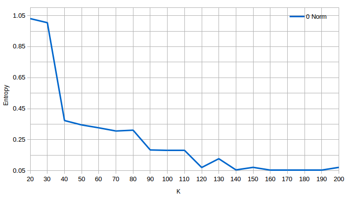

## KDD Cup 99 - Data analysis notes - Session 01

**Parameters:**

  - iterations: 100
  - runs: 3
  - epsilon: 1E-15
  
**Hardware Info:**s

- Intel(R) Core(TM) i7-4710MQ CPU @ 2.50GHz
- 8 CPUs
- L2 Cache: 6144 KB
- RAM: 24 GB

**Normalization algorithms**

- 0 Norm : No normalization
- 1 Norm : Linear normalization using MultivariateStatisticalSummary
- 2 Norm V1 : Square normalization using MultivariateStatisticalSummary
- 2 Norm V2 : Square normalization using own algorithm (unoptimized)
  
  
### WSSSE Measurements Summary

| K   | 0 Norm         | 1 Norm         | 2 Norm V1      | 2 Norm V2      |
| --: | -------------: | -------------: | -------------: | -------------: |
|  20 | 1.9696514E+014 | 2.2904237E+005 | 4.3784157E+007 | 3.8057302E+007 |
|  30 | 5.6755400E+013 | 1.7107815E+005 | 1.7004460E+007 | 2.1600232E+007 |
|  40 | 2.3165027E+013 | 1.3190235E+005 | 1.1209960E+007 | 1.1494260E+007 |
|  50 | 9.7214604E+012 | 1.0447789E+005 | 9.0914170E+006 | 8.6326303E+006 |
|  60 | 5.7940705E+012 | 9.5267617E+004 | 7.2293744E+006 | 7.0563526E+006 |
|  70 | 4.1616896E+012 | 8.6125711E+004 | 5.9230347E+006 | 5.7566134E+006 |
|  80 | 2.9146388E+012 | 7.3845306E+004 | 5.0921967E+006 | 4.9256146E+006 |
|  90 | 1.9523072E+012 | 6.6876439E+004 | 4.4714847E+006 | 4.5734270E+006 |
| 100 | 1.3019335E+012 | 6.1448099E+004 | 4.0125952E+006 | 3.9029345E+006 |
| 110 | 1.0467821E+012 | 5.6012300E+004 | 3.4075621E+006 | 3.3709265E+006 |
| 120 | 8.6900014E+011 | 5.4390947E+004 | 3.1168149E+006 | 3.1857216E+006 |
| 130 | 7.2864994E+011 | 5.1872389E+004 | 2.9372071E+006 | 2.8445672E+006 |
| 140 | 5.9555032E+011 | 4.8923170E+004 | 2.6306517E+006 | 2.6107100E+006 |
| 150 | 4.9046555E+011 | 4.5427279E+004 | 2.4155787E+006 | 2.3853406E+006 |
| 160 | 4.0147264E+011 | 4.2897758E+004 | 2.3129631E+006 | 2.2196285E+006 |
| 170 | 3.5007406E+011 | 4.1475633E+004 | 2.1354720E+006 | 2.1526927E+006 |
| 180 | 3.1688886E+011 | 3.9147821E+004 | 1.9974410E+006 | 2.0374920E+006 |
| 190 | 2.7446209E+011 | 3.8301643E+004 | 1.8920837E+006 | 1.8609909E+006 |
| 200 | 2.3417739E+011 | 3.6818688E+004 | 1.7491625E+006 | 1.7759818E+006 |

Corresponding graphs:

***Conclusions:*** 

- It appears that WSSSE variation becomes relatively small around K = 100 for 0 Norm
- It appears that WSSSE variation becomes relatively small around K = 190 for 1 Norm
- It appears that WSSSE variation becomes relatively small around K = 150 for 2 Norm
- We need an extra measurement of model performance, like [entropy](https://en.wikipedia.org/wiki/Boltzmann%27s_entropy_formula)

### Average Cluster Distance Summary

| K   | 0 Norm      | 1 Norm    | 2 Norm V1 | 2 Norm V2 |
| --: | ----------: | --------: | --------: | --------: |
|  20 | 39933773.25 | 0.0467583 | 8.9384044 | 7.7692842 |
|  30 | 11586444.70 | 0.0349251 | 3.4714095 | 4.4096225 |
|  40 |  4729070.81 | 0.0269275 | 2.2884797 | 2.3465188 |
|  50 |  1984606.99 | 0.0213288 | 1.8559855 | 1.7623256 |
|  60 |  1182842.11 | 0.0194486 | 1.4758551 | 1.4405332 |
|  70 |   849596.46 | 0.0175823 | 1.2091698 | 1.1751954 |
|  80 |   595014.76 | 0.0150753 | 1.0395567 | 1.0055495 |
|  90 |   398557.66 | 0.0136526 | 0.9128402 | 0.9336514 |
| 100 |   265785.83 | 0.0125444 | 0.8191593 | 0.7967724 |
| 110 |   213697.42 | 0.0114347 | 0.6956436 | 0.6881645 |
| 120 |   177403.77 | 0.0111037 | 0.6362884 | 0.6503555 |
| 130 |   148751.70 | 0.0105896 | 0.5996220 | 0.5807099 |
| 140 |   121579.81 | 0.0099875 | 0.5370397 | 0.5329686 |
| 150 |   100127.07 | 0.0092738 | 0.4931332 | 0.4869601 |
| 160 |    81959.44 | 0.0087574 | 0.4721845 | 0.4531305 |
| 170 |    71466.57 | 0.0084671 | 0.4359502 | 0.4394658 |
| 180 |    64691.91 | 0.0079919 | 0.4077716 | 0.4159479 |
| 190 |    56030.61 | 0.0078192 | 0.3862632 | 0.3799157 |
| 200 |    47806.61 | 0.0075164 | 0.3570863 | 0.3625614 |

Corresponding graphs:

***Conclusions:*** 

- It appears that average distance variation becomes relatively small around K = 100 for 0 Norm
- It appears that average distance variation becomes relatively small around K = 190 for 1 Norm
- It appears that average distance variation becomes relatively small around K = 150 for 2 Norm

### Entropy Measurements Summary

| K   | 0 Norm      | 1 Norm      | 2 Norm V1   | 2 Norm V2   |
| --: | ----------: | ----------: | ----------: | ----------: |
|  20 | 1.030382784 | 0.023958458 | 0.056413800 | 0.039313616 |
|  30 | 1.004268112 | 0.016352879 | 0.025969438 | 0.028996423 |
|  40 | 0.373495654 | 0.013784937 | 0.022835085 | 0.019177819 |
|  50 | 0.345385532 | 0.012284532 | 0.016230996 | 0.016676270 |
|  60 | 0.326670450 | 0.011243656 | 0.016977223 | 0.016668562 |
|  70 | 0.306190454 | 0.010114768 | 0.015911810 | 0.014925045 |
|  80 | 0.311458987 | 0.008838104 | 0.013773152 | 0.012925435 |
|  90 | 0.183929862 | 0.010175283 | 0.012782342 | 0.011054088 |
| 100 | 0.181976027 | 0.008231151 | 0.012682832 | 0.013376931 |
| 110 | 0.181939679 | 0.008641291 | 0.011157741 | 0.012815921 |
| 120 | 0.070889118 | 0.008191932 | 0.010838750 | 0.009993948 |
| 130 | 0.127379171 | 0.007713087 | 0.011212552 | 0.007804668 |
| 140 | 0.055315151 | 0.007424113 | 0.008988638 | 0.010858436 |
| 150 | 0.071836985 | 0.007546811 | 0.007716758 | 0.007023452 |
| 160 | 0.054634565 | 0.007002846 | 0.011197128 | 0.008631437 |
| 170 | 0.054812584 | 0.007815290 | 0.007054059 | 0.007183821 |
| 180 | 0.054094060 | 0.006836278 | 0.008751188 | 0.005960632 |
| 190 | 0.055486589 | 0.006441717 | 0.006596787 | 0.005806205 |
| 200 | 0.071722239 | 0.007137942 | 0.006261701 | 0.006982307 |

Corresponding graphs:

***Conclusions:***

- 0 Norm has a very high entropy compared to 1 or 2 Norms
- It seems that for both 1 and 2 Norms K = 150 is reasonably small

### Training Runtime Measurements Summary

| K   | 0 Norm    | 1 Norm    | 2 Norm V1 | 2 Norm V2 |
| --: | --------: | --------: | --------: | --------: |
|  20 |     00:38 |     02:52 |     01:16 |     01:02 |
|  30 |     01:03 |     04:14 |     01:30 |     01:20 |
|  40 |     02:08 |     06:21 |     02:07 |     02:17 |
|  50 |     03:35 |     09:26 |     03:44 |     02:05 |
|  60 |     03:03 |     08:42 |     03:28 |     02:55 |
|  70 |     03:57 |     10:23 |     03:30 |     03:36 |
|  80 |     04:31 |     09:55 |     04:26 |     03:48 |
|  90 |     07:06 |     13:23 |     04:40 |     04:12 |
| 100 |     04:28 |     17:23 |     05:00 |     05:40 |
| 110 |     05:28 |     18:56 |     06:16 |     05:04 |
| 120 |     06:03 |     21:25 |     07:10 |     06:20 |
| 130 |     08:01 |     26:19 |     10:03 |     10:01 |
| 140 |     08:56 |     23:10 |     06:53 |     07:28 |
| 150 |     05:16 |     23:16 |     09:08 |     08:46 |
| 160 |     05:06 |     31:49 |     09:35 |     09:30 |
| 170 |     04:30 |     30:44 |     10:31 |     10:11 |
| 180 |     06:55 |     33:02 |     12:37 |     11:43 |
| 190 |     07:41 |     36:33 |     11:55 |     14:56 |
| 200 |     10:14 |     39:51 |     16:14 |     14:39 |

Corresponding graphs:

Time was measured in minutes:seconds.

***Conclusions:***

- It appears that the runtime varies linearly with the increase of K
- 1 Norm has the highest gradient for K
- 1 Norm seems to be the worst choice in terms of performance

## Conclusions

- The use of MultivariateStatisticalSummary vs the "accurate" implementation of the L2 Normalization has no significant impact, so it can be used for convenience
- 0 Norm has a very high entropy compared to the other normalization forms
- 1 Norm has poor performance compared to 2 Norm
- **K=150 model with 2 Norm is the best choice found so far**
- Visualizing the cluster-label or label-cluster matrices in the experiment data files for such a high K is a little difficult, so further evaluations methods should be taken into account (e.g. [Standford](http://nlp.stanford.edu/IR-book/html/htmledition/evaluation-of-clustering-1.html))
- Training a model is rather CPU intensive, and for this data size the required available RAM seems to be in the 8 GB range (totally used by driver and executors)

## Experiment Data 

| K   | L0Norm                                              | L1Norm                                              | L2NormV1                                              | L2NormV2                                              |
| --: | :-------------------------------------------------: | :-------------------------------------------------: | :---------------------------------------------------: | :---------------------------------------------------: |
|  20 | [data](kddcup99/session_01/kmeans_1E-15_020_0100_03_L0Norm.md) | [data](kddcup99/session_01/kmeans_1E-15_020_0100_03_L1Norm.md) | [data](kddcup99/session_01/kmeans_1E-15_020_0100_03_L2NormV1.md) | [data](kddcup99/session_01/kmeans_1E-15_020_0100_03_L2NormV2.md) |
|  30 | [data](kddcup99/session_01/kmeans_1E-15_030_0100_03_L0Norm.md) | [data](kddcup99/session_01/kmeans_1E-15_030_0100_03_L1Norm.md) | [data](kddcup99/session_01/kmeans_1E-15_030_0100_03_L2NormV1.md) | [data](kddcup99/session_01/kmeans_1E-15_030_0100_03_L2NormV2.md) |
|  40 | [data](kddcup99/session_01/kmeans_1E-15_040_0100_03_L0Norm.md) | [data](kddcup99/session_01/kmeans_1E-15_040_0100_03_L1Norm.md) | [data](kddcup99/session_01/kmeans_1E-15_040_0100_03_L2NormV1.md) | [data](kddcup99/session_01/kmeans_1E-15_040_0100_03_L2NormV2.md) |
|  50 | [data](kddcup99/session_01/kmeans_1E-15_050_0100_03_L0Norm.md) | [data](kddcup99/session_01/kmeans_1E-15_050_0100_03_L1Norm.md) | [data](kddcup99/session_01/kmeans_1E-15_050_0100_03_L2NormV1.md) | [data](kddcup99/session_01/kmeans_1E-15_050_0100_03_L2NormV2.md) |
|  60 | [data](kddcup99/session_01/kmeans_1E-15_060_0100_03_L0Norm.md) | [data](kddcup99/session_01/kmeans_1E-15_060_0100_03_L1Norm.md) | [data](kddcup99/session_01/kmeans_1E-15_060_0100_03_L2NormV1.md) | [data](kddcup99/session_01/kmeans_1E-15_060_0100_03_L2NormV2.md) |
|  70 | [data](kddcup99/session_01/kmeans_1E-15_070_0100_03_L0Norm.md) | [data](kddcup99/session_01/kmeans_1E-15_070_0100_03_L1Norm.md) | [data](kddcup99/session_01/kmeans_1E-15_070_0100_03_L2NormV1.md) | [data](kddcup99/session_01/kmeans_1E-15_070_0100_03_L2NormV2.md) |
|  80 | [data](kddcup99/session_01/kmeans_1E-15_080_0100_03_L0Norm.md) | [data](kddcup99/session_01/kmeans_1E-15_080_0100_03_L1Norm.md) | [data](kddcup99/session_01/kmeans_1E-15_080_0100_03_L2NormV1.md) | [data](kddcup99/session_01/kmeans_1E-15_080_0100_03_L2NormV2.md) |
|  90 | [data](kddcup99/session_01/kmeans_1E-15_090_0100_03_L0Norm.md) | [data](kddcup99/session_01/kmeans_1E-15_090_0100_03_L1Norm.md) | [data](kddcup99/session_01/kmeans_1E-15_090_0100_03_L2NormV1.md) | [data](kddcup99/session_01/kmeans_1E-15_090_0100_03_L2NormV2.md) |
| 100 | [data](kddcup99/session_01/kmeans_1E-15_100_0100_03_L0Norm.md) | [data](kddcup99/session_01/kmeans_1E-15_100_0100_03_L1Norm.md) | [data](kddcup99/session_01/kmeans_1E-15_100_0100_03_L2NormV1.md) | [data](kddcup99/session_01/kmeans_1E-15_100_0100_03_L2NormV2.md) |
| 110 | [data](kddcup99/session_01/kmeans_1E-15_110_0100_03_L0Norm.md) | [data](kddcup99/session_01/kmeans_1E-15_110_0100_03_L1Norm.md) | [data](kddcup99/session_01/kmeans_1E-15_110_0100_03_L2NormV1.md) | [data](kddcup99/session_01/kmeans_1E-15_110_0100_03_L2NormV2.md) |
| 120 | [data](kddcup99/session_01/kmeans_1E-15_120_0100_03_L0Norm.md) | [data](kddcup99/session_01/kmeans_1E-15_120_0100_03_L1Norm.md) | [data](kddcup99/session_01/kmeans_1E-15_120_0100_03_L2NormV1.md) | [data](kddcup99/session_01/kmeans_1E-15_120_0100_03_L2NormV2.md) |
| 130 | [data](kddcup99/session_01/kmeans_1E-15_130_0100_03_L0Norm.md) | [data](kddcup99/session_01/kmeans_1E-15_130_0100_03_L1Norm.md) | [data](kddcup99/session_01/kmeans_1E-15_130_0100_03_L2NormV1.md) | [data](kddcup99/session_01/kmeans_1E-15_130_0100_03_L2NormV2.md) |
| 140 | [data](kddcup99/session_01/kmeans_1E-15_140_0100_03_L0Norm.md) | [data](kddcup99/session_01/kmeans_1E-15_140_0100_03_L1Norm.md) | [data](kddcup99/session_01/kmeans_1E-15_140_0100_03_L2NormV1.md) | [data](kddcup99/session_01/kmeans_1E-15_140_0100_03_L2NormV2.md) |
| 150 | [data](kddcup99/session_01/kmeans_1E-15_150_0100_03_L0Norm.md) | [data](kddcup99/session_01/kmeans_1E-15_150_0100_03_L1Norm.md) | [data](kddcup99/session_01/kmeans_1E-15_150_0100_03_L2NormV1.md) | [data](kddcup99/session_01/kmeans_1E-15_150_0100_03_L2NormV2.md) |
| 160 | [data](kddcup99/session_01/kmeans_1E-15_160_0100_03_L0Norm.md) | [data](kddcup99/session_01/kmeans_1E-15_160_0100_03_L1Norm.md) | [data](kddcup99/session_01/kmeans_1E-15_160_0100_03_L2NormV1.md) | [data](kddcup99/session_01/kmeans_1E-15_160_0100_03_L2NormV2.md) |
| 170 | [data](kddcup99/session_01/kmeans_1E-15_170_0100_03_L0Norm.md) | [data](kddcup99/session_01/kmeans_1E-15_170_0100_03_L1Norm.md) | [data](kddcup99/session_01/kmeans_1E-15_170_0100_03_L2NormV1.md) | [data](kddcup99/session_01/kmeans_1E-15_170_0100_03_L2NormV2.md) |
| 180 | [data](kddcup99/session_01/kmeans_1E-15_180_0100_03_L0Norm.md) | [data](kddcup99/session_01/kmeans_1E-15_180_0100_03_L1Norm.md) | [data](kddcup99/session_01/kmeans_1E-15_180_0100_03_L2NormV1.md) | [data](kddcup99/session_01/kmeans_1E-15_180_0100_03_L2NormV2.md) |
| 190 | [data](kddcup99/session_01/kmeans_1E-15_190_0100_03_L0Norm.md) | [data](kddcup99/session_01/kmeans_1E-15_190_0100_03_L1Norm.md) | [data](kddcup99/session_01/kmeans_1E-15_190_0100_03_L2NormV1.md) | [data](kddcup99/session_01/kmeans_1E-15_190_0100_03_L2NormV2.md) |
| 200 | [data](kddcup99/session_01/kmeans_1E-15_200_0100_03_L0Norm.md) | [data](kddcup99/session_01/kmeans_1E-15_200_0100_03_L1Norm.md) | [data](kddcup99/session_01/kmeans_1E-15_200_0100_03_L2NormV1.md) | [data](kddcup99/session_01/kmeans_1E-15_200_0100_03_L2NormV2.md) |

[Back](kddcup.md)
