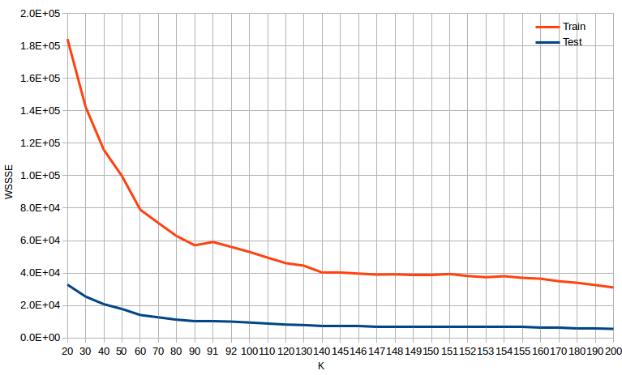
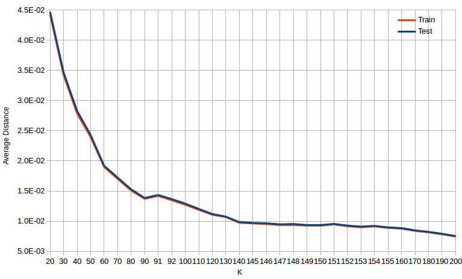
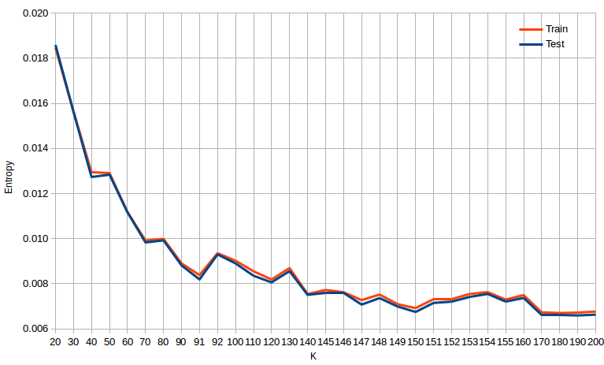
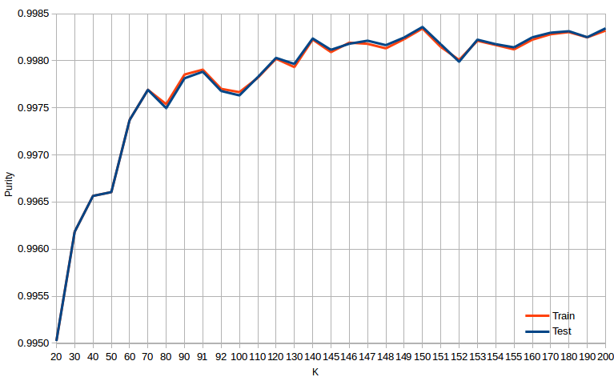

## KDD Cup 99 - Data analysis notes - Session 02

**Parameters:**

  - iterations: 100
  - runs: 3
  - epsilon: 1E-10
  
**Hardware Info:**s

- Intel(R) Core(TM) i7-4710MQ CPU @ 2.50GHz
- 8 CPUs
- L2 Cache: 6144 KB
- RAM: 24 GB

**Normalization algorithms**

- 2 Norm V1 : Square normalization using MultivariateStatisticalSummary followed by 1 Norm for easier graphical prepresentation
  
  
### WSSSE Measurements Summary

| K   | Train          | Test           |
| --: | -------------: | -------------: |
|  20 | 1.8421161E+005 | 3.2813035E+004 |
|  30 | 1.4226370E+005 | 2.5429080E+004 |
|  40 | 1.1587159E+005 | 2.0761725E+004 |
|  50 | 9.9670331E+004 | 1.7823631E+004 |
|  60 | 7.9028556E+004 | 1.4085866E+004 |
|  70 | 7.0784007E+004 | 1.2644398E+004 |
|  80 | 6.2762372E+004 | 1.1215233E+004 |
|  90 | 5.7047156E+004 | 1.0171477E+004 |
|  91 | 5.9103954E+004 | 1.0531737E+004 |
|  92 | 5.6077202E+004 | 1.0035005E+004 |
| 100 | 5.3008347E+004 | 9.4850920E+003 |
| 110 | 4.9474253E+004 | 8.8396246E+003 |
| 120 | 4.6082448E+004 | 8.2160311E+003 |
| 130 | 4.4479859E+004 | 7.8990291E+003 |
| 140 | 4.0508616E+004 | 7.2400197E+003 |
| 145 | 4.0087148E+004 | 7.1359962E+003 |
| 146 | 3.9638873E+004 | 7.0903124E+003 |
| 147 | 3.9028323E+004 | 6.9622346E+003 |
| 148 | 3.9174259E+004 | 7.0062448E+003 |
| 149 | 3.8565650E+004 | 6.8690688E+003 |
| 150 | 3.8544717E+004 | 6.8626367E+003 |
| 151 | 3.9384905E+004 | 7.0140047E+003 |
| 152 | 3.8143390E+004 | 6.8133554E+003 |
| 153 | 3.7422781E+004 | 6.6841911E+003 |
| 154 | 3.8022925E+004 | 6.7688689E+003 |
| 155 | 3.7001632E+004 | 6.5939154E+003 |
| 160 | 3.6479335E+004 | 6.5023137E+003 |
| 170 | 3.4931874E+004 | 6.2288044E+003 |
| 180 | 3.3944014E+004 | 6.0445776E+003 |
| 190 | 3.2545935E+004 | 5.8122952E+003 |
| 200 | 3.1080717E+004 | 5.5429661E+003 |

Corresponding graphs:

***Conclusions:*** 

- It appears that WSSSE variation becomes relatively small around K = 140

### Average Cluster Distance Summary

| K   | Train        | Test         |
| --: | -----------: | -----------: |
|  20 | 0.0442349788 | 0.0447017888 |
|  30 | 0.0341619710 | 0.0346424934 |
|  40 | 0.0278243993 | 0.0282840722 |
|  50 | 0.0239339685 | 0.0242814538 |
|  60 | 0.0189772318 | 0.0191894290 |
|  70 | 0.0169974573 | 0.0172256910 |
|  80 | 0.0150712115 | 0.0152787134 |
|  90 | 0.0136988090 | 0.0138567863 |
|  91 | 0.0141927106 | 0.0143475748 |
|  92 | 0.0134658928 | 0.0136708683 |
| 100 | 0.0127289646 | 0.0129217117 |
| 110 | 0.0118803179 | 0.0120423798 |
| 120 | 0.0110658391 | 0.0111928472 |
| 130 | 0.0106810074 | 0.0107609896 |
| 140 | 0.0097273876 | 0.0098632093 |
| 145 | 0.0096261800 | 0.0097214962 |
| 146 | 0.0095185351 | 0.0096592603 |
| 147 | 0.0093719229 | 0.0094847775 |
| 148 | 0.0094069667 | 0.0095447335 |
| 149 | 0.0092608205 | 0.0093578562 |
| 150 | 0.0092557939 | 0.0093490936 |
| 151 | 0.0094575495 | 0.0095553049 |
| 152 | 0.0091594227 | 0.0092819568 |
| 153 | 0.0089863819 | 0.0091059940 |
| 154 | 0.0091304953 | 0.0092213521 |
| 155 | 0.0088852508 | 0.0089830097 |
| 160 | 0.0087598310 | 0.0088582191 |
| 170 | 0.0083882371 | 0.0084856124 |
| 180 | 0.0081510209 | 0.0082346369 |
| 190 | 0.0078152984 | 0.0079181944 |
| 200 | 0.0074634538 | 0.0075512825 |

Corresponding graphs:

***Conclusions:*** 

- It appears that average distance variation becomes relatively small around K = 140

### Entropy Measurements Summary

| K   | Train        | Test         |
| --: | -----------: | -----------: |
|  20 | 0.0184553357 | 0.0185853851 |
|  30 | 0.0156283929 | 0.0156329292 |
|  40 | 0.0129468275 | 0.0127332359 |
|  50 | 0.0129065662 | 0.0128346388 |
|  60 | 0.0111757183 | 0.0111652456 |
|  70 | 0.0099186011 | 0.0098323749 |
|  80 | 0.0099897454 | 0.0099244512 |
|  90 | 0.0089051714 | 0.0088153273 |
|  91 | 0.0083841204 | 0.0081911865 |
|  92 | 0.0093552426 | 0.0093012397 |
| 100 | 0.0090219790 | 0.0089040352 |
| 110 | 0.0085549356 | 0.0083534586 |
| 120 | 0.0081893550 | 0.0080621066 |
| 130 | 0.0086969262 | 0.0085623543 |
| 140 | 0.0075479998 | 0.0075085559 |
| 145 | 0.0077259357 | 0.0075823529 |
| 146 | 0.0076253289 | 0.0075938864 |
| 147 | 0.0072761483 | 0.0070779012 |
| 148 | 0.0075231061 | 0.0073660132 |
| 149 | 0.0070953539 | 0.0069921471 |
| 150 | 0.0069217520 | 0.0067508124 |
| 151 | 0.0073072802 | 0.0071519429 |
| 152 | 0.0073321505 | 0.0072068360 |
| 153 | 0.0075497310 | 0.0074173304 |
| 154 | 0.0076294816 | 0.0075488998 |
| 155 | 0.0073006230 | 0.0072118554 |
| 160 | 0.0074977678 | 0.0073695154 |
| 170 | 0.0067336546 | 0.0066294784 |
| 180 | 0.0067040699 | 0.0066023412 |
| 190 | 0.0067232456 | 0.0065956122 |
| 200 | 0.0067697863 | 0.0066315153 |

Corresponding graphs:

***Conclusions:***

- It seems that for K = 150, the entropy is reasonably small

### Purity Measurements Summary

| K   | Train        | Test         |
| --: | -----------: | -----------: |
|  20 | 0.9950251994 | 0.9950251994 |
|  30 | 0.9961850337 | 0.9961850337 |
|  40 | 0.9965649214 | 0.9965649214 |
|  50 | 0.9966055036 | 0.9966055036 |
|  60 | 0.9973710423 | 0.9973710423 |
|  70 | 0.9976911373 | 0.9976911373 |
|  80 | 0.9975376934 | 0.9974960595 |
|  90 | 0.9978534661 | 0.9978134796 |
|  91 | 0.9979048542 | 0.9978829578 |
|  92 | 0.9977014630 | 0.9976786101 |
| 100 | 0.9976664038 | 0.9976322913 |
| 110 | 0.9978186471 | 0.9978257405 |
| 120 | 0.9980210778 | 0.9980300882 |
| 130 | 0.9979324693 | 0.9979660592 |
| 140 | 0.9982249493 | 0.9982357982 |
| 145 | 0.9980911961 | 0.9981159142 |
| 146 | 0.9981913309 | 0.9981799431 |
| 147 | 0.9981795644 | 0.9982126388 |
| 148 | 0.9981312980 | 0.9981649576 |
| 149 | 0.9982292716 | 0.9982466967 |
| 150 | 0.9983418932 | 0.9983584068 |
| 151 | 0.9981464263 | 0.9981744939 |
| 152 | 0.9980083508 | 0.9979892186 |
| 153 | 0.9982117420 | 0.9982235373 |
| 154 | 0.9981670776 | 0.9981758562 |
| 155 | 0.9981202520 | 0.9981417982 |
| 160 | 0.9982235085 | 0.9982480590 |
| 170 | 0.9982808999 | 0.9982971025 |
| 180 | 0.9983032321 | 0.9983134503 |
| 190 | 0.9982477617 | 0.9982494214 |
| 200 | 0.9983198011 | 0.9983434213 |

Corresponding graphs:

***Conclusions:***

- It seems that for K = 150, the entropy is reasonably small

## Conclusions

- **K=150 model is the best choice found so far**

## Experiment Data 

| K   |  Train                                                                 |  Train                                                                |
| --: | :--------------------------------------------------------------------: | :-------------------------------------------------------------------: |
|  20 | [data](kddcup99/session_02/kmeans_1E-10_020_0100_03_L2NormV1_train.md) | [data](kddcup99/session_02/kmeans_1E-10_020_0100_03_L2NormV1_test.md) | 
|  30 | [data](kddcup99/session_02/kmeans_1E-10_030_0100_03_L2NormV1_train.md) | [data](kddcup99/session_02/kmeans_1E-10_030_0100_03_L2NormV1_test.md) | 
|  40 | [data](kddcup99/session_02/kmeans_1E-10_040_0100_03_L2NormV1_train.md) | [data](kddcup99/session_02/kmeans_1E-10_040_0100_03_L2NormV1_test.md) | 
|  50 | [data](kddcup99/session_02/kmeans_1E-10_050_0100_03_L2NormV1_train.md) | [data](kddcup99/session_02/kmeans_1E-10_050_0100_03_L2NormV1_test.md) | 
|  60 | [data](kddcup99/session_02/kmeans_1E-10_060_0100_03_L2NormV1_train.md) | [data](kddcup99/session_02/kmeans_1E-10_060_0100_03_L2NormV1_test.md) | 
|  70 | [data](kddcup99/session_02/kmeans_1E-10_070_0100_03_L2NormV1_train.md) | [data](kddcup99/session_02/kmeans_1E-10_070_0100_03_L2NormV1_test.md) | 
|  80 | [data](kddcup99/session_02/kmeans_1E-10_080_0100_03_L2NormV1_train.md) | [data](kddcup99/session_02/kmeans_1E-10_080_0100_03_L2NormV1_test.md) | 
|  90 | [data](kddcup99/session_02/kmeans_1E-10_090_0100_03_L2NormV1_train.md) | [data](kddcup99/session_02/kmeans_1E-10_090_0100_03_L2NormV1_test.md) | 
|  91 | [data](kddcup99/session_02/kmeans_1E-10_091_0100_03_L2NormV1_train.md) | [data](kddcup99/session_02/kmeans_1E-10_091_0100_03_L2NormV1_test.md) | 
|  92 | [data](kddcup99/session_02/kmeans_1E-10_092_0100_03_L2NormV1_train.md) | [data](kddcup99/session_02/kmeans_1E-10_092_0100_03_L2NormV1_test.md) | 
| 100 | [data](kddcup99/session_02/kmeans_1E-10_100_0100_03_L2NormV1_train.md) | [data](kddcup99/session_02/kmeans_1E-10_100_0100_03_L2NormV1_test.md) | 
| 110 | [data](kddcup99/session_02/kmeans_1E-10_110_0100_03_L2NormV1_train.md) | [data](kddcup99/session_02/kmeans_1E-10_110_0100_03_L2NormV1_test.md) | 
| 120 | [data](kddcup99/session_02/kmeans_1E-10_120_0100_03_L2NormV1_train.md) | [data](kddcup99/session_02/kmeans_1E-10_120_0100_03_L2NormV1_test.md) | 
| 130 | [data](kddcup99/session_02/kmeans_1E-10_130_0100_03_L2NormV1_train.md) | [data](kddcup99/session_02/kmeans_1E-10_130_0100_03_L2NormV1_test.md) | 
| 140 | [data](kddcup99/session_02/kmeans_1E-10_140_0100_03_L2NormV1_train.md) | [data](kddcup99/session_02/kmeans_1E-10_140_0100_03_L2NormV1_test.md) | 
| 145 | [data](kddcup99/session_02/kmeans_1E-10_145_0100_03_L2NormV1_train.md) | [data](kddcup99/session_02/kmeans_1E-10_145_0100_03_L2NormV1_test.md) | 
| 146 | [data](kddcup99/session_02/kmeans_1E-10_146_0100_03_L2NormV1_train.md) | [data](kddcup99/session_02/kmeans_1E-10_146_0100_03_L2NormV1_test.md) | 
| 147 | [data](kddcup99/session_02/kmeans_1E-10_147_0100_03_L2NormV1_train.md) | [data](kddcup99/session_02/kmeans_1E-10_147_0100_03_L2NormV1_test.md) | 
| 148 | [data](kddcup99/session_02/kmeans_1E-10_148_0100_03_L2NormV1_train.md) | [data](kddcup99/session_02/kmeans_1E-10_148_0100_03_L2NormV1_test.md) | 
| 149 | [data](kddcup99/session_02/kmeans_1E-10_149_0100_03_L2NormV1_train.md) | [data](kddcup99/session_02/kmeans_1E-10_149_0100_03_L2NormV1_test.md) | 
| 150 | [data](kddcup99/session_02/kmeans_1E-10_150_0100_03_L2NormV1_train.md) | [data](kddcup99/session_02/kmeans_1E-10_150_0100_03_L2NormV1_test.md) | 
| 151 | [data](kddcup99/session_02/kmeans_1E-10_151_0100_03_L2NormV1_train.md) | [data](kddcup99/session_02/kmeans_1E-10_151_0100_03_L2NormV1_test.md) | 
| 152 | [data](kddcup99/session_02/kmeans_1E-10_152_0100_03_L2NormV1_train.md) | [data](kddcup99/session_02/kmeans_1E-10_152_0100_03_L2NormV1_test.md) | 
| 153 | [data](kddcup99/session_02/kmeans_1E-10_153_0100_03_L2NormV1_train.md) | [data](kddcup99/session_02/kmeans_1E-10_153_0100_03_L2NormV1_test.md) | 
| 154 | [data](kddcup99/session_02/kmeans_1E-10_154_0100_03_L2NormV1_train.md) | [data](kddcup99/session_02/kmeans_1E-10_154_0100_03_L2NormV1_test.md) | 
| 155 | [data](kddcup99/session_02/kmeans_1E-10_155_0100_03_L2NormV1_train.md) | [data](kddcup99/session_02/kmeans_1E-10_155_0100_03_L2NormV1_test.md) | 
| 160 | [data](kddcup99/session_02/kmeans_1E-10_160_0100_03_L2NormV1_train.md) | [data](kddcup99/session_02/kmeans_1E-10_160_0100_03_L2NormV1_test.md) | 
| 170 | [data](kddcup99/session_02/kmeans_1E-10_170_0100_03_L2NormV1_train.md) | [data](kddcup99/session_02/kmeans_1E-10_170_0100_03_L2NormV1_test.md) | 
| 180 | [data](kddcup99/session_02/kmeans_1E-10_180_0100_03_L2NormV1_train.md) | [data](kddcup99/session_02/kmeans_1E-10_180_0100_03_L2NormV1_test.md) | 
| 190 | [data](kddcup99/session_02/kmeans_1E-10_190_0100_03_L2NormV1_train.md) | [data](kddcup99/session_02/kmeans_1E-10_190_0100_03_L2NormV1_test.md) | 
| 200 | [data](kddcup99/session_02/kmeans_1E-10_200_0100_03_L2NormV1_train.md) | [data](kddcup99/session_02/kmeans_1E-10_200_0100_03_L2NormV1_test.md) | 

[Back](kddcup.md)
